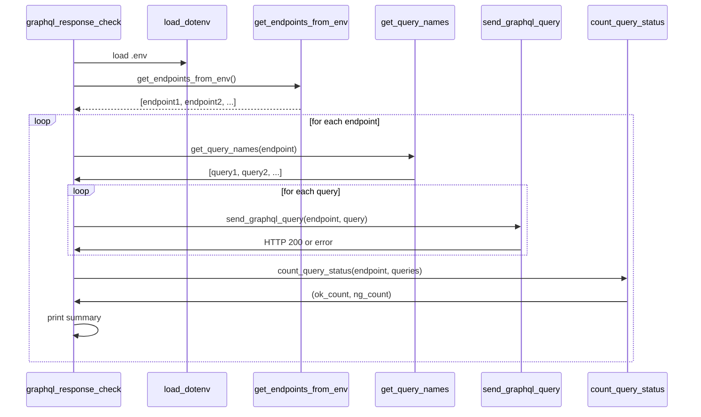

# GraphQL Response Check Tool

This tool performs automated health checks on multiple GraphQL endpoints.  
It uses GraphQL introspection to fetch available query operations, then attempts to send each query and logs whether the HTTP response is `200 OK`.

## 📁 Project Structure
```
.
├── graphql_response_check
│   ├── __init__.py
│   ├── __main__.py
│   ├── graphql_response_check.py
│   └── lib
│       ├── get_env.py
│       └── query.py
├── README.md
└── requirements.txt
```
## 📦 Requirements

```bash
pip install -r requirements.txt
```

Required packages:
- `requests`: For making HTTP calls
- `python-dotenv`: For environment variable loading


## 📄 .env Format
Define GraphQL endpoints as a comma-separated list:

```
GRAPHQL_ENDPOINTS="http://10.11.15.231:9006/graphql/,http://10.11.15.232:9007/graphql/"
```

## 🚀 Usage
```
python -m graphql_response_check
```
Make sure `.env` exists and includes a valid `GRAPHQL_ENDPOINTS` entry before running the script.


## 🔍 Output Example
```
========== Checking Endpoint: http://10.11.15.231:9006/graphql/ ==========
[INFO] Found 3 queries: ['getUsers', 'getOrders', 'getStock']
getUsers: OK
getOrders: OK
getStock: NG
---------- Summary for http://10.11.15.231:9006/graphql/ ----------
Total: 3 | OK: 2 | NG: 1
```
Note: NG results may appear if a query requires arguments that are not automatically provided.

## 📊 Sequence Diagram


## 🛡️ Design Principles
- Loosely Coupled Modules: Each responsibility is isolated (env loading, query logic, control loop).
- Minimal External Dependencies: Only requests and python-dotenv used.
- Environment Driven: All config passed via .env.

## 🧩 Future Extensions
- Output JSON report
- CI integration
- GraphQL mutation support
- Retry/backoff for failed endpoints
- Feel free to modify the endpoints in .env to target your own GraphQL microservices!

## ✏️Author
- inuverse44/https://github.com/inuverse44