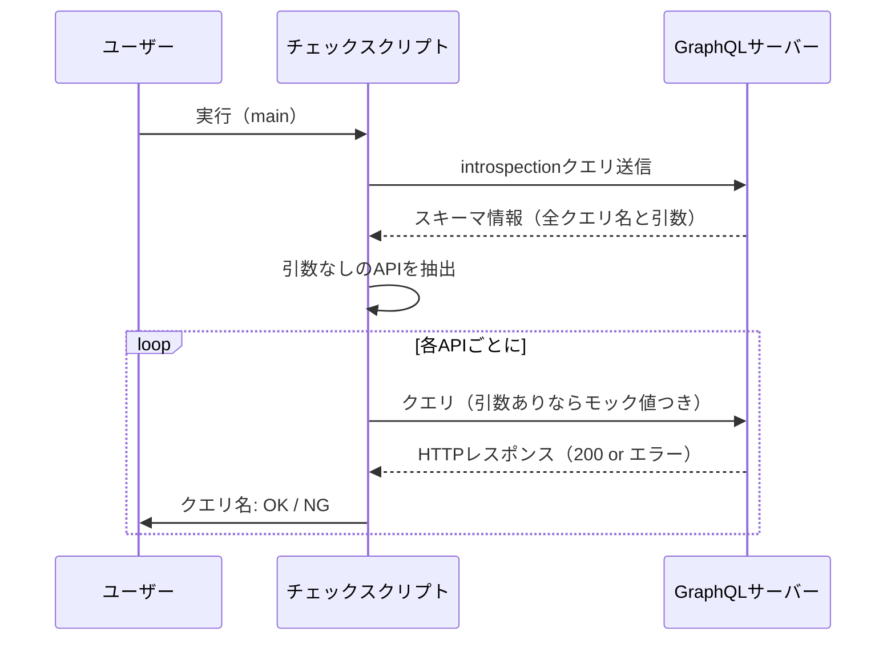

# 🔍 GraphQLサーバーの全スキーマAPIチェック自動化構想

## 🎯 目的
1. 特定のポート（マイクロサービス単位）のGraphQLエンドポイントから、提供されている全API名（Query/Mutation）を取得したい
2. 取得したAPIを1つずつ呼び出し、200 OKかどうかを判定したい

## ✅ 実現可能性と前提条件

|ステップ|	実現可否|	条件・注意|
|---|---|---|
|GraphQLの全API名を取得する	|✅ 可能	|Introspection 機能が有効である必要あり |
|APIをループで実行して応答を検査	|✅ 可能	|引数なしのAPIは即実行可能、引数ありはモック生成が必要|
|応答の成功判定	|✅ 可能	|HTTP 200 ＋ errors がレスポンスに含まれていないことをチェック|

## 🧠 技術的背景
### 🔹 GraphQL Introspectionとは？
GraphQLサーバーに対して特別なクエリを送ることで、スキーマ全体（型情報・操作名・引数型など）を取得できる標準仕様。

### 🔹 代表的なintrospectionクエリ
```graphql
{
  __schema {
    queryType {
      fields {
        name
        args {
          name
          type {
            name
            kind
          }
        }
      }
    }
    mutationType {
      fields {
        name
        args {
          name
          type {
            name
            kind
          }
        }
      }
    }
  }
}
```

## 🛠️ 実装ステップの流れ
### ① introspectionでスキーマ取得
→ 操作名と引数構造を取得

### ② 引数なしのAPIは自動生成でリクエスト作成
例: `query { users }` など

### ③ 引数ありAPIにはモック値を投入
例: `query { user(id: 1) }`

### ④ HTTP 200 かつ GraphQLエラーなしなら OK 判定


## 🧪 Pythonでの判定例（簡易）
```python
response = requests.post(endpoint, json={"query": query})
if response.status_code == 200 and "errors" not in response.json():
    print("OK")
else:
    print("NG")
```

## ⚠️ 注意点
|項目	| 解説|
|---|---|
|Introspectionの有効化	|本番環境では無効なことも多い。|
|引数ありクエリの難しさ	|型ごとのモック値生成が必要。|
|入れ子フィールドの取得	|__type クエリで深掘りすれば対応可能。|
|200 OKでも GraphQL的にエラーなことがある	|errors キーをチェックすべき。|

## 📊 シーケンス図

